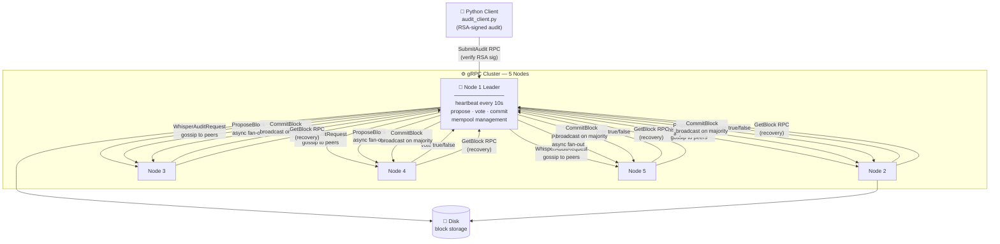

<div align="center">

# 🔗 Distributed Blockchain Audit System

**Tamper-proof, fault-tolerant distributed ledger for file-access audit logging**

[](https://isocpp.org/)
[](https://grpc.io/)
[](https://www.openssl.org/)
[](https://protobuf.dev/)
[](https://cmake.org/)
[](https://python.org/)

*5-node consensus · Raft-inspired leader election · SHA-256 hash chain · Merkle-tree integrity · RSA-SHA256 signatures*

</div>

---

## ⚡ Impact at a Glance

<table>
  <tr>
    <td align="center">🏗️<br/><strong>5-Node Cluster</strong><br/><sub>Fault-tolerant distributed system</sub></td>
    <td align="center">🗳️<br/><strong>Majority-Quorum Consensus</strong><br/><sub>Propose → Vote → Commit over gRPC</sub></td>
    <td align="center">🔐<br/><strong>Tamper-Evident by Construction</strong><br/><sub>SHA-256 hash chain + Merkle tree</sub></td>
    <td align="center">🔑<br/><strong>RSA-SHA256 Signatures</strong><br/><sub>Cryptographically signed audit records</sub></td>
  </tr>
  <tr>
    <td align="center">🔄<br/><strong>Automatic Block Recovery</strong><br/><sub>Lagging nodes self-heal in background</sub></td>
    <td align="center">👑<br/><strong>Raft-Inspired Election</strong><br/><sub>Term-based bully election, majority vote</sub></td>
    <td align="center">💬<br/><strong>Gossip Propagation</strong><br/><sub>Peer-to-peer audit distribution</sub></td>
    <td align="center">💻<br/><strong>~3,400 Lines C++17</strong><br/><sub>Thread-safe, RAII concurrency</sub></td>
  </tr>
</table>

> **No record can be altered or forged undetected.** Altering any audit changes its hash → changes the Merkle root → changes the block hash → breaks the chain — and every peer independently verifies before committing.

---

## 🏛️ Architecture



---

## 🔩 Core Components

| Component | File | Responsibility |
|-----------|------|----------------|
| **Node** | `src/node.cc` | Leader election, heartbeat loop, block proposal loop, recovery loop |
| **BlockManager** | `src/block_manager.cc` | Create / verify / commit blocks, Merkle root, disk persistence |
| **BlockchainService** | `src/blockchain_service.cc` | gRPC handlers — whisper, propose, vote, commit, get block |
| **FileAuditService** | `src/file_audit_service.cc` | gRPC handler — submit audit, validate fields, verify RSA signature |
| **Mempool** | `src/mempool.cc` | Thread-safe pending audit store, content-hash dedup, sorted by timestamp |
| **CryptoUtils** | `src/crypto_utils.cc` | SHA-256, Merkle tree, RSA-SHA256 verify (OpenSSL EVP) |
| **Python Client** | `client/audit_client.py` | Generate RSA keypair, sign audits, submit over gRPC |

---

## ⚙️ How It Works

### 1. 👑 Leader Election (Raft-inspired)

```
Heartbeat every 10s  →  3 missed heartbeats  →  start election
  Candidate fans out TriggerElection via std::async (concurrent)
  Vote criteria:  highest latest_block_id
                  → largest mempool (tie-break)
                  → largest address (final tie-break)
  Winner broadcasts NotifyLeadership to all peers
```

### 2. 📬 Audit Submission + Gossip

```
Client signs audit (RSA-SHA256, PKCS1v15)
  → SubmitAudit RPC → validate fields + verify OpenSSL signature
  → add to thread-safe mempool (dedup by reqId + content hash)
  → WhisperAuditRequest to all peers (P2P gossip)
```

### 3. 🗳️ Consensus — Propose → Vote → Commit

```
Leader (mempool ≥ 5 audits):
  1. createBlock       → Merkle root + SHA-256 hash chain
  2. ProposeBlock      → async fan-out, await majority vote
  3. Peers verify:     id sequence · prev_hash chain · Merkle root · block hash
  4. commitBlock       → persist to disk
  5. CommitBlock       → broadcast to all peers
  6. Remove committed audits from mempool
```

### 4. 🔐 Block Integrity (Tamper-Evident by Construction)

```
blockHash   = SHA-256( id : previous_hash : merkle_root )
merkle_root = pairwise SHA-256 over all audit hashes (odd node duplicated)
```

| What changes | What breaks |
|---|---|
| Any single audit field | Its hash → Merkle root → block hash → chain |
| Any block hash | Every subsequent block's `previous_hash` |
| Signature on an audit | Signature verification in `FileAuditService` |

### 5. 🔄 Automatic Block Recovery

```
Background loop (every 30s):
  Compare own latest_block_id with peers (from heartbeat metadata)
  If behind → GetBlock RPC from most-advanced peer
  Verify + commit each missing block → remove audits from mempool
```

---

## 🔌 gRPC Services

```protobuf
service FileAuditService {
  rpc SubmitAudit         (FileAudit)               returns (FileAuditResponse);
}

service BlockChainService {
  rpc WhisperAuditRequest (FileAudit)               returns (WhisperResponse);
  rpc ProposeBlock        (Block)                   returns (BlockVoteResponse);
  rpc CommitBlock         (Block)                   returns (BlockCommitResponse);
  rpc GetBlock            (GetBlockRequest)          returns (GetBlockResponse);
  rpc SendHeartbeat       (HeartbeatRequest)         returns (HeartbeatResponse);
  rpc TriggerElection     (TriggerElectionRequest)   returns (TriggerElectionResponse);
  rpc NotifyLeadership    (NotifyLeadershipRequest)  returns (NotifyLeadershipResponse);
}
```

---

## 🔒 Concurrency Design

| Mechanism | Where | Why |
|-----------|-------|-----|
| `std::lock_guard` (RAII) | All shared state | Exception-safe, no manual unlock |
| `verifyBlockNoLock` | Commit path | Prevents re-entrant deadlock inside mutex |
| `std::async` + futures | Vote / commit fan-out | Non-blocking parallel peer calls |
| 3 background `std::thread`s | Heartbeat · Proposal · Recovery | Clean lifecycle separation |

---

## 🚀 Build and Run

### Prerequisites

```bash
# Required
CMake 3.14+  |  C++17 compiler  |  gRPC + Protocol Buffers
OpenSSL      |  yaml-cpp        |  nlohmann/json  |  Abseil
```

### Build

```bash
./build.sh
```

### Start 5-node cluster

```bash
./start_nodes.sh
# Nodes start on ports 50051–50055
# Logs: node1.log … node5.log
```

### Submit audit records

```bash
cd client
pip install grpcio grpcio-tools cryptography
python generate_proto.py
python audit_client.py \
  --server localhost:50051 \
  --file-id "file123" --file-name "report.pdf" \
  --user-id "user456" --user-name "John Doe" \
  --access-type 1 --generate-keys
```

### Watch consensus live

```bash
tail -f node1.log | grep -E "CONSENSUS|COMMIT|VERIFY|ELECT"
```

### Stop cluster

```bash
./stop_nodes.sh
```

---

## 🛠️ Tech Stack

| Layer | Technology |
|-------|-----------|
|  | C++17 — RAII, `std::async`, `std::thread` |
|  | gRPC — bidirectional streaming, async stubs |
|  | Protocol Buffers v3 |
|  | SHA-256, RSA-SHA256 verify (EVP API) |
|  | CMake 3.14+ with FetchContent |
|  | grpcio, cryptography (PKCS1v15 signing) |

---

## 📐 Design Decisions & Trade-offs

| Decision | Why | Known Limitation |
|----------|-----|-----------------|
| Raft-inspired (not full Raft) | Simpler; sufficient for append-only audit log | No term/vote persistence across restarts |
| Majority quorum | Tolerates up to ⌊(n−1)/2⌋ failures | Requires >half nodes live to commit |
| Gossip ("whisper") propagation | Decentralized audit ingestion, no single bottleneck | Eventual consistency in mempool across peers |
| Hash chain + Merkle | O(log n) audit proof, tamper-evident at every layer | Merkle proof not exposed via API |
| `verifyBlockNoLock` pattern | Allows verification inside the commit mutex path | Caller must hold lock — not enforced by type system |

---

<div align="center">

**Built with C++17 · gRPC · OpenSSL · Protocol Buffers**

*Distributed Systems · Consensus Protocols · Cryptographic Integrity · Fault Tolerance*

</div>
